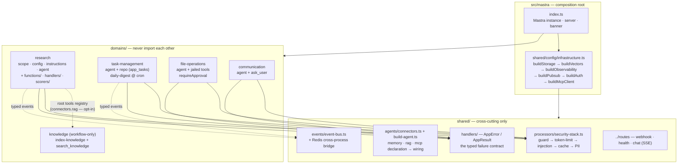
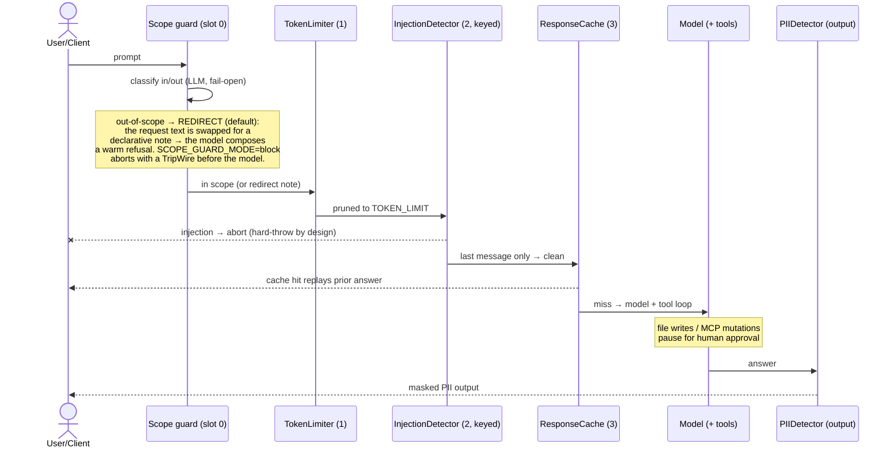
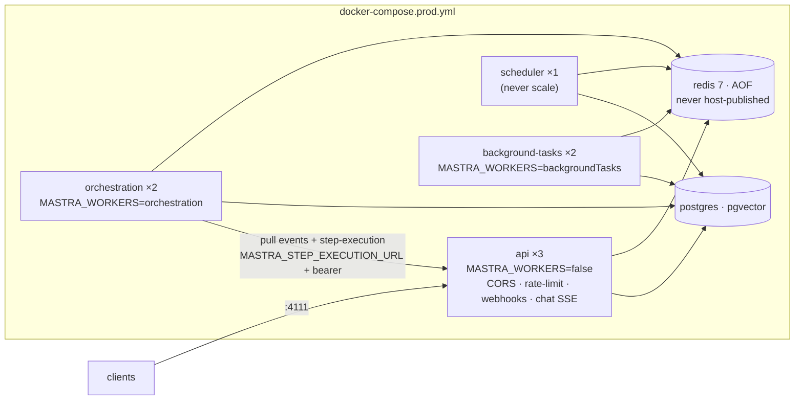

# Mastra Boilerplate

> A **production-shaped, project-agnostic starter** for AI agents built on [Mastra](https://mastra.ai).
> Zero-config boot on a fresh clone, every infrastructure dependency **env-optional**, hardened by a
> defense-in-depth guardrail pipeline, a **streaming chat endpoint with per-request tracing**, HA-ready
> Docker topology, two-tier eval gates that block CI, and a self-updating dependency toolchain —
> documented end-to-end for humans **and** AI coding agents.

**Stack:** TypeScript · Node ≥ 22.13 · `@mastra/core` 1.66 · `mastra` CLI 1.29 · `@mastra/ai-sdk` (AI SDK v7) · Vitest 3 · ESLint 9 (flat) · Prettier · Docker Compose · GitHub Actions · Renovate

|                                           |                                                                                                          |
| ----------------------------------------- | -------------------------------------------------------------------------------------------------------- |
| 🚀 **Boots with nothing configured**      | no DB, no API keys, no `.env` — a startup banner tells you what is active                                |
| 🧱 **Vertical slices / DDD**              | 4 agent domains + 1 workflow-only RAG slice, zero sibling imports, one-responsibility files             |
| 🧩 **Declarative connectors**             | `connectors: { memory, rag, mcp }` in `config.ts` — capabilities declared, not hand-wired                |
| 🛡️ **Guardrails by default**              | scope enforcement (warm redirect) + injection/PII detection + token budget + cache + FS jail + approval  |
| 🧠 **Memory that scales**                 | observational memory + **keyless semantic recall** (local multilingual E5) + crash-proof degradation     |
| 💬 **Streaming chat, traced**             | official `chatRoute` (AI SDK v7) at `POST /chat/:agentId` with one log line per pipeline stage           |
| 🧮 **Cost-aware turns**                   | injection scan on the last message only + online judges sampled at 10% — one turn ≠ a dozen model calls  |
| 🔌 **MCP in & out**                       | consume any MCP server from one JSON env var; expose a read-only MCP server yourself                      |
| ☁️ **Real HA**                            | split workers over Redis Streams pubsub, dual build artifacts, chaos script                              |
| ✅ **Quality that blocks**                | 8 CI jobs incl. typecheck + coverage floors + keyless eval gates with drift baselines                    |
| 🤖 **Agent-readable repo**                | 18 hierarchical `AGENTS.md` files, 10 ADRs, 25 gotchas learned the hard way                              |

---

## Table of contents

- [Why this exists](#-why-this-exists) · [Architecture](#-architecture) · [What's inside](#-whats-inside)
- [Quick start](#-quick-start) · [The startup banner](#-the-startup-banner) · [Configuration](#-configuration)
- [Security model](#-security-model) · [Memory & RAG](#-memory--rag) · [MCP](#-mcp) · [HTTP surface & streaming](#-http-surface--streaming)
- [Testing & CI](#-testing--ci) · [Deployment & HA](#-deployment--ha) · [Self-updating](#-self-updating)
- [What changed recently](#-what-changed-recently-sept-16-17-wave) · [How this boilerplate was built](#-how-this-boilerplate-was-built-roadmap--provenance)
- [Official documentation references](#-official-documentation-references) · [Conventions](#-conventions) · [Known caveats](#-known-caveats)

---

## 🎯 Why this exists

Most agent starter projects make you choose between _a toy that boots instantly_ and _a shape you can actually ship_.
This boilerplate refuses the trade-off:

- **Zero-config is the contract.** `git clone → npm install --legacy-peer-deps → npm run dev` works with no
  database, no API keys and no `.env`. Every "grown-up" capability (Postgres, Redis, auth, embeddings, MCP,
  OTLP, rate limiting) activates **only when its env var exists** and degrades with an explicit banner line —
  never a crash, never a silent lie.
- **Production concerns are not filler.** Auth, guardrails, eval gates, HA worker topology, RAG **and a traced
  streaming chat endpoint** were added because they are what professional Mastra deployments actually need (see
  [the gap analysis](docs/PRODUCTION-GAP-ANALYSIS.md) and the [spec series](docs/specs/README.md) that drove them).
- **The repo documents itself for your future agents.** Every directory has an `AGENTS.md` with rules,
  conventions and hard-won gotchas; every architectural choice has an ADR.

## 🏗 Architecture

### Vertical slices + one composition root



**The one structural rule:** a domain owns everything it needs (agent, `scope`/`config`/`instructions`, tools,
`functions`, `handlers`, workflows, scorers, entities, events) and **never imports a sibling**. Cross-domain needs
are mediated three ways: typed events on the shared bus, Mastra's top-level registries (`tools`, `vectors`) reached
through **declarative connectors**, or the plain-data `shared/agents/domain-catalog.ts`. The `knowledge` slice is the
showcase: its query tool reaches the research agent through the instance-level tools registry — no coupling,
degrade-safe, and **opt-in per agent** (`connectors: { rag: true }`).

### Domain anatomy (the four one-responsibility files + your logic)

Every **agent** domain is a fixed skeleton, each file small enough to read in one screen. A structural test
(`tests/unit/structure/file-size.test.ts`) enforces a **150 LOC ceiling** per domain file (200 for `shared/`,
`LEGACY_LARGE` can only shrink) so a domain cannot bloat into a mini-monolith.

```
domains/research/
├── scope.ts           # DomainScope — boundaries only (name/scope/siblings from domain-catalog.ts)
├── config.ts          # the knobs: modelKey, maxSteps, connectors, disableResponseCache
├── instructions.ts    # the capability body (scopedInstructions prepends the hard boundary)
├── agent.ts           # ~20 LOC: buildDomainAgent(...) + the 3 exports tests reference
├── handlers/          # errors.ts (extends AppError) · responses.ts (AppResult bound) · index.ts
├── functions/         # heavy logic behind the tools — pure where possible, returns the Result
├── tools/             # thin adapters: Zod schemas + execute, nothing else
├── workflows/         # steps/ + schemas.ts (shared shapes)
├── scorers/ · entities/ · events.ts
└── index.ts           # barrel — the ONLY import surface
```

**Declarative connectors** replace hand-wired tool maps. The agent's `config.ts` declares what it is:

```typescript
// domains/research/config.ts
export const researchSettings: DomainAgentSettings = {
  modelKey: 'research', // precedence: MODEL_RESEARCH > MODEL > DEFAULT_MODEL
  maxSteps: 50,
  connectors: {
    memory: 'observational', // 'basic' (default, title-only) | 'observational' (compaction + recall)
    rag: true, // OPT-IN: attaches search_knowledge from the root registry (no agent is born with it)
    mcp: 'research', // the MCP_SERVERS routing key whose tools this agent receives
  },
};
```

`resolveConnectorTools()` **never throws** — an unconfigured connector degrades to `{}` (zero spawn, ~0 ms), and
connector tools are merged **before** local `tools` so **local wins** on key collision. The `DomainScope` reads its
identity from the single `shared/agents/domain-catalog.ts` table (`siblingsOf(domain)`), so the sibling roster is
never copied around; a domain's `refusal.tone` overrides the global refusal voice.

### Domain failures are typed values, not strings

`shared/handlers/` is the only shared part of the failure contract (`AppError` with `code` / `kind` / `domain`,
`AppResult` with `isFail()` narrowing, `ok`/`fail` builders). Each domain owns its concrete error classes and binds
`AppResult` to them as `<d>Result<T>`; heavy logic lives in `functions/` and **returns** that `Result`, while the
tool is a thin adapter that maps it onto its **unchanged** `outputSchema`. The `Result` instance never crosses the
tool boundary, and known causes map onto the tool's `reason` enum while infrastructure failures are **re-thrown** —
a downed DB is never disguised as `NOT_FOUND`. (See [ADR-008](docs/adr/008-application-data-in-mastra-storage.md)
and the pattern in `domains/task-management/handlers`.)

### The agent request pipeline (every `generate()`/`stream()`)



Deterministic slots (1, 3 + the FS jail) work **without API keys**; the LLM classifiers (2, output) are
inert — and clearly labeled in the banner — when no provider key exists. This asymmetry is deliberate:
Mastra's built-in detectors _hard-throw_ on guard-model failure, so keyless users must never be routed
through them ([ADR-009](docs/adr/009-guardrails-security-processor-pipeline.md)).

### The chat endpoint is observable by default

`POST /chat/:agentId` is the framework-official streaming bridge (`chatRoute` from `@mastra/ai-sdk`, AI SDK v7 UI
messages). The chat route is **traced end-to-end** out of the box — one line per pipeline event, so you can see
_exactly_ where a slow or stuck turn is spending its time:

```text
[chat 3f9c1a02] → POST /chat/comms msgs=1 thread=nuevo-9c1d
[chat 3f9c1a02] · scope-guard:communication ok 1.25s
[chat 3f9c1a02] · token-limiter ok 0.02s
[chat 3f9c1a02] · prompt-injection-detector ok 1.80s
[chat 3f9c1a02] · mastra/response-cache ok 0.00s
[chat 3f9c1a02] ← 200 ttfb=8.90s [scope-guard 1.25s, token-limiter 0.02s, …]
[chat 3f9c1a02] ✓ done 12.40s first-byte=9.12s bytes=1183 [ … ]
```

- **What it prints:** entry (method, path, `msgs=`, `thread=`), one line **per processor** with verdict
  (`ok` / `block` / `fail`) and duration, **TTFB** (the end of the guardrail prelude), and close
  (`first-byte`, `bytes`). A cancelled client stream and a handler failure each get their own line.
- **How it stays transparent:** processor timing is a deep Proxy — `instanceof`, `id`, options and private
  fields keep working, so structural tests and the pipeline itself are unaffected.
- **How you use it:** ON outside production by default; `CHAT_TRACE=on|off` overrides. The short id travels back
  as the `x-mastra-trace` response header so a client can correlate a slow response with the server log.
- **Why it exists:** the guardrail prelude (memory recall + scope classifier + injection scan) runs **before** the
  first token — measured at ~9–20 s with DeepInfra. Without a trace that latency is invisible; with it, it is a
  number you can act on. (Budget client connect timeouts ≥ 30 s — the fix is latency, never a shorter timeout.)

## 🧰 What's inside

### Example domains (delete what you don't need)

| Domain            | Agent                    | Tools / internals                                                                            | Workflows                                                    | Notable                                                                                                           |
| ----------------- | ------------------------ | -------------------------------------------------------------------------------------------- | ------------------------------------------------------------ | ----------------------------------------------------------------------------------------------------------------- |
| `research`        | `research-agent`         | `web_search` (key-free DuckDuckGo), `web_fetch`, `summarize`                                 | `deep-research` (4 steps + **suspend-for-review**)           | reference pattern for provider-agnostic tools + `functions/` extraction; `rag: true` opt-in in `config.ts`        |
| `task-management` | `task-management-agent`  | `create_task`, `update_task` (optimistic locking), `schedule_task` (real `mastra.schedules`) | `daily-digest` — declarative `0 9 * * *` UTC cron            | reference for **domain-owned persistence** (`app_tasks`, ADR-008) and the typed error/result contract             |
| `file-operations` | `file-operations-agent`  | `read_file`, `write_file`, `edit_file` — jailed + approval-gated                             | —                                                            | reference for LLM-exposed FS access done safely (ADR-009); `disableResponseCache: true`                           |
| `communication`   | `communication-agent`    | `ask_user` (structured)                                                                      | —                                                            | minimal slice skeleton (`connectors: { memory: 'basic' }`)                                                        |
| `knowledge`       | _(no agent — by design)_ | `search_knowledge` tool                                                                      | `index-knowledge` (chunk → embed → dimension-guard → upsert) | chat-with-docs E2E example, fail-fast on embedder/dimension mismatch                                              |

### Infrastructure builders (`shared/config/` + `shared/`) — one env var each, one module each

| Module                              | Activates with                                             | Without it                                                                                 |
| ----------------------------------- | ---------------------------------------------------------- | ------------------------------------------------------------------------------------------ |
| `infrastructure.ts`                 | composition root — builds every service in order           | nothing to configure: it is the wiring                                                      |
| `storage.ts` + `db.ts`              | `DATABASE_URL` (postgres) / `LIBSQL_URL`                    | LibSQL `file:./mastra.db`; both share one URL resolver                                      |
| `vectors.ts`                        | follows storage (PgVector / LibSQLVector) + embedder ladder | semantic recall off, **latched at boot**; **never crashes**                                 |
| `model.ts`                          | `MODEL` / `MODEL_<AGENT>` / `DEFAULT_MODEL`, `EVAL_JUDGE_MODEL` | `openai/gpt-4o-mini`                                                                       |
| `embedder.ts` + `embedding-parse.ts`| `EMBEDDING_CONFIG` (one JSON var) > `EMBEDDING_MODEL`      | local fastembed E5 (key-free, 1024d); malformed JSON fails the boot                         |
| `fastembed-cache.ts`                | always (probes the on-disk ONNX artifacts)                 | poisoned cache ⇒ banner says recall off; repair with `npm run warm:embeddings`              |
| `agents/connectors.ts`              | `connectors` in each domain `config.ts`                    | zero spawn; no agent gets RAG, memory defaults to `basic`                                   |
| `observability.ts`                  | on by default; `OTEL_EXPORTER_OTLP_ENDPOINT` adds OTLP      | storage-only exporters (byte-stable) + sensitive-data filter                                |
| `observability/request-trace.ts`    | on outside production; `CHAT_TRACE` overrides              | chat pipeline goes silent (diagnostics only — nothing else depends on it)                   |
| `pubsub.ts`                         | `REDIS_URL` → Redis Streams                                | in-process bus; split workers unavailable                                                   |
| `auth.ts`                           | `MASTRA_JWT_SECRET` (+ `MASTRA_WORKER_AUTH_TOKEN` bearer)   | **dev: boots with ⚠️ warning · prod: refuses to boot** (`AUTH_DISABLED=true` escape hatch)  |
| `mcp-parse.ts` / `mcp.ts`           | `MCP_SERVERS` (JSON, `${VAR}` interpolation, per-agent routing) | zero connects, zero subprocesses                                                       |
| `processors/security-stack.ts`      | on by default; `SECURITY_PROCESSORS=off` / `log`           | scope guard alone; deterministic slots stay on                                              |
| `handlers/` (`AppError`/`AppResult`) | always — the typed failure contract                        | domains would throw bare `Error`s; not the shipped shape                                   |
| `schedules.ts` / `env.ts`           | banner reporting / Zod validation of malformed env         | silent-none / no-op — absence is always legal                                               |

Plus: `custom routes` (`/hooks/:source` HMAC · `/health/version` · `/chat/:agentId` SSE), the outbound
read-only `MCPServer`, `AppDatabase` factory, workspace jail, shared response cache, event bus bridge.

### Quality & ops tooling

- **4 test tiers + gates**: smoke (zero-config boot of the real instance), unit (**444 tests**), cross-domain/HTTP/
  schedules integration, two-tier evals — all blocking in CI, with ratcheted coverage floors (see
  [Testing & CI](#-testing--ci)).
- **CI**: 8 blocking jobs (`lint, typecheck, build, coverage, test-smoke, test-unit, test-integration, test-evals`)
  - a non-gating nightly [`evals-live.yml`](.github/workflows/evals-live.yml) for LLM-judge experiments.
- **Docker**: dev compose (app + pgvector) + HA prod compose + chaos script (`tests/chaos/api-kill.sh`).
- **Operator scripts**: `init`, `health-check`, `warm:embeddings`, `update` (bump all Mastra packages + re-run the gate).
- **Docs**: 10 ADRs (`docs/adr/`), 8 phase specs + index (`docs/specs/`), gap analysis, testing guide,
  18 hierarchical `AGENTS.md`, 25 gotchas in the root doc.

## 🚀 Quick start

```bash
# 1. Install (peer conflict @mastra/evals ↔ vitest is a known upstream quirk — see gotcha #1)
npm install --legacy-peer-deps

# 2. Run — Studio opens at http://localhost:4111
npm run dev

# 3. Talk to an agent (Studio handles threads automatically)
```

Optional upgrades, all independent:

```bash
# Real Postgres + pgvector (dev):
cd docker && docker-compose up -d

# Pre-warm / repair the local embedding model (~1.31 GB, one-off):
npm run warm:embeddings

# Full quality gate before committing anything:
npm run lint && npx tsc --noEmit && npm run test:all && npm run build:all

# A frontend consuming a streaming agent — copy/paste level:
node examples/stream-consumer.mjs     # needs `npm run dev` up (see [streaming](#-http-surface--streaming))
```

### The startup banner

Every boot prints what is live and what is dormant — the banner is the zero-config contract made visible:

```text
━━━━━━━━━━━━━━━━━━━━━━━━━━━━━━━━━━━━━━━━━━━━━━━━
🚀 Mastra Boilerplate — service availability
━━━━━━━━━━━━━━━━━━━━━━━━━━━━━━━━━━━━━━━━━━━━━━━━
Environment: development
✅ Storage          LibSQL local file:./mastra.db — feedback read-only (set DATABASE_URL for PostgreSQL)
✅ Vector store     LibSQLVector (file:./mastra.db — cosine)
✅ Semantic recall  on (fastembed/multilingual-e5-large · 1024d · scope:resource)
✅ Knowledge RAG    tool search_knowledge registered (opt-in per agent: connectors.rag)
✅ Observability    traces stored in configured storage (set ENABLE_OBSERVABILITY=false to disable)
○ OTLP export      set OTEL_EXPORTER_OTLP_ENDPOINT to export
○ PubSub           in-process (EventEmitterPubSub) — split workers unavailable
✅ Auth             JWT (MASTRA_JWT_SECRET) — /api/* + Studio protected
○ MCP client       off — set MCP_SERVERS to connect external servers (see .env.example)
✅ Guardrails       injection|pii|token-limit|cache active (block)
✅ CORS            allow-list: http://localhost:3000
✅ Rate limiting    100 req / 60000 ms fixed window per IP — in-process, per replica
○ Webhook signing  no WEBHOOK_SECRET — /hooks/* rejects 401
○ Schedules        inactive — MASTRA_WORKERS=false; wf_daily-digest will NOT fire (run one scheduler worker)
Agents: research, tasks, files, comms
━━━━━━━━━━━━━━━━━━━━━━━━━━━━━━━━━━━━━━━━━━━━━━━━
```

_(rows above include a `.env` with a provider key + JWT secret; a bare clone shows `○` for both — still boots, still browsable, `generate()` fails clearly.)_

## ⚙️ Configuration

Every variable in [`.env.example`](.env.example) is **optional** and documented inline. The short version:

| Group           | Variables                                                                                                                                                                                           | Notes                                                                                                      |
| --------------- | --------------------------------------------------------------------------------------------------------------------------------------------------------------------------------------------------- | ---------------------------------------------------------------------------------------------------------- |
| Providers       | `DEEPINFRA_API_KEY` `OPENAI_API_KEY` `ANTHROPIC_API_KEY` `GOOGLE_API_KEY`                                                                                                                           | set ≥1 to use agents; never required to boot                                                               |
| Models          | `MODEL` · `MODEL_RESEARCH` `MODEL_TASKS` `MODEL_FILES` `MODEL_COMMS` · `DEFAULT_MODEL` · `OBSERVATIONAL_MEMORY_MODEL` · `SCOPE_GUARD_MODEL` `SECURITY_MODEL` `EVAL_JUDGE_MODEL`                    | precedence `MODEL_<AGENT>` > `MODEL` > `DEFAULT_MODEL`; **no model string is ever hard-coded** (gotcha #5) |
| Embeddings      | `EMBEDDING_CONFIG` (one JSON var, third-party endpoints) · `EMBEDDING_MODEL` (legacy string) · `SEMANTIC_RECALL=off`                                                                                 | precedence + fail-fast in gotcha #24; local fastembed E5 when unset                                        |
| Scope guard     | `SCOPE_GUARD=off` · `SCOPE_GUARD_MODE=redirect\|block` (redirect default) · `SCOPE_GUARD_TONE=warm\|formal\|neutral` · `SCOPE_GUARD_MODEL`                                                            | per-domain voice in `scope.ts` (`refusal.tone`); gotcha #7                                                 |
| Storage/vectors | `DATABASE_URL` · `LIBSQL_URL` · `SEMANTIC_RECALL=off`                                                                                                                                               | vector store follows storage; unset → local `file:./mastra.db`                                             |
| Auth            | `MASTRA_JWT_SECRET` · `AUTH_DISABLED` · `MASTRA_WORKER_AUTH_TOKEN` · `AUTH_PROVIDER` (doc-extension)                                                                                                | production without auth **refuses to boot**                                                                |
| HA/workers      | `REDIS_URL` · `MASTRA_WORKERS` · `MASTRA_STEP_EXECUTION_URL`                                                                                                                                        | split topology needs Redis; exactly ONE scheduler                                                          |
| MCP             | `MCP_SERVERS` (JSON) · `ENABLE_MCP_SERVER=true`                                                                                                                                                     | malformed JSON = actionable boot error                                                                     |
| Guardrails      | `SECURITY_PROCESSORS` · `TOKEN_LIMIT` · `PI_THRESHOLD` · `RESPONSE_CACHE(_TTL)` · `COST_LIMIT_USD` · `REVIEW_APPROVAL=off` · `FILE_JAIL=off` · `WORKSPACE_ROOT`                                     | see [security model](#-security-model)                                                                     |
| Evals           | `EVAL_STORAGE_URL` (throwaway; default `file:./eval-ci.db`) · `EVAL_ONLINE_SAMPLING_RATE` (default 0.1)                                                                                              | never the app DB (ADR-010); sampling applies to live runs only                                             |
| Diagnostics     | `CHAT_TRACE=on\|off` (default ON outside production)                                                                                                                                                | per-request chat pipeline trace + `x-mastra-trace` header                                                  |
| HTTP surface    | `CORS_ORIGIN` (CSV) · `RATE_LIMIT_WINDOW_MS`+`RATE_LIMIT_MAX_REQUESTS` · `WEBHOOK_SECRET`                                                                                                           | limiter/webhook caveats in gotchas #18-#19                                                                 |
| Observability   | `ENABLE_OBSERVABILITY=false` · `ENABLE_TRACING` · `LOG_LEVEL` · `SERVICE_NAME` · `OTEL_EXPORTER_OTLP_ENDPOINT`                                                                                      | OTLP is a guarded optional companion                                                                       |
| Server/platform | `MASTRA_HOST` `MASTRA_PORT` · `MASTRA_PLATFORM_*`                                                                                                                                                   | `mastra deploy` scripts target the Mastra platform                                                         |

## 🛡️ Security model

Defense in depth, ordered, and each layer optional-but-explicit:

1. **Server auth (ADR-004)** — built-in JWT protects `/api/*` + Studio login; worker bearer token via
   `CompositeAuth`; `NODE_ENV=production` with no auth **exits 1** naming its fix. `/health` stays public
   on purpose (compose healthcheck).
2. **Scope guard (gotcha #7)** — per-domain LLM classifier decides in/out _before the model runs_. Since
   2026-09-17 the default is **redirect, not abort**: the request text is swapped for a **declarative** note and
   the agent answers with **one warm sentence** in the user's language, naming at most one fitting alternative.
   The model never sees the off-topic request, so it cannot answer it from general knowledge. `SCOPE_GUARD_MODE=block`
   restores the hard TripWire, `SCOPE_GUARD_TONE` / per-domain `refusal.tone` set the voice, and the classifier
   **fails open** (a broken classifier never takes the product down). Out-of-scope means a **substantive request owned
   by another domain** — greetings, thanks and "what can you do?" pass (the contract is `buildScopeClassifierPrompt()`,
   provable offline).
3. **Security stack (ADR-009)** — token budget → prompt-injection detector → response cache (input);
   PII mask (output). Fail-closed classifiers, inert-without-key rule, mutating agents excluded from cache.
   On providers without structured outputs (DeepInfra/DeepSeek) the detectors' instructions **name the schema keys
   literally**, so a model that would otherwise invent keys can no longer leave the detector inert while still paying
   the call (gotcha #23).
4. **Workspace jail + human approval** — every FS path resolved inside `WORKSPACE_ROOT` (realpath-checked);
   `write_file`/`edit_file` require approval and a declined call provably performs no fs write.
5. **HITL workflows** — `deep-research` suspends at `review-findings`; snapshots persist in storage and
   survive restarts (`resume` after kill verified in integration tier). Rejection ends the run `failed`.
6. **MCP trust boundary (ADR-007)** — mutating tool _names_ require approval by default (camelCase-aware),
   `inheritDefaultEnv:false` opt-in for stdio servers, `allowedHosts` for remote ones, tool responses
   treated as untrusted model input. The exposed server is **read-only by construction**.
7. **Webhooks fail closed** — `POST /hooks/:source` HMAC-SHA256 over raw bytes; no `WEBHOOK_SECRET` ⇒
   every request 401s. Rate limit + signature run as _route-level_ middleware (global middleware is
   skipped on public routes — gotcha #18).

## 🧠 Memory & RAG

- **All four agents share `buildDomainMemory()`**: observational memory (compaction) + **semantic recall**.
  The tier is declared per agent with `connectors.memory` (`basic` default, `observational` opt-in) — the chat
  route requires memory, so there is no "off".
- **Key-free default**: local `@mastra/fastembed` multilingual E5 (1024d) — recall works with zero API keys.
- **Declare the embedder in ONE variable**: `EMBEDDING_CONFIG` carries the whole model as JSON —
  `{"providerId":"openai","modelId":"text-embedding-3-small","dimension":1536}`, or a third-party /
  self-hosted OpenAI-compatible endpoint with `url` + `apiKey` + `headers` (no extra dependency):
  ```bash
  EMBEDDING_CONFIG='{"providerId":"openai","modelId":"my-embed-v1","dimension":1024,
                     "url":"https://gateway.internal/v1","apiKey":"${ACME_EMBED_KEY}",
                     "headers":{"X-Tenant":"acme"}}'
  ```
  Precedence: `SEMANTIC_RECALL=off` > `EMBEDDING_CONFIG` > `EMBEDDING_MODEL` (legacy string) > local fastembed.
  Absent is always legal; **present-but-malformed fails the boot** (`[Embeddings] Invalid EMBEDDING_CONFIG …`),
  and an unset `${VAR}` inside the JSON also fails the boot — loud beats wrong.
- **Degradation is latched, loud-once, and crash-proof**: `buildVectors()` checks the ONNX artifacts on disk at
  boot and, if the cache is poisoned, latches `○ Semantic recall off (no embedder)`; `buildDomainMemory()`
  **probes the embedder before constructing `Memory`**, so a broken model degrades the turn to plain history
  instead of 500-ing it. Repair or pre-warm with `npm run warm:embeddings` (the package's own `warmup()` only
  fetches bge-small/base — **not** the multilingual-E5 this repo defaults to).
- **Dimension stickiness** (gotcha #12): an index belongs to one dimension forever — the knowledge indexer
  fail-fasts (`VectorDimensionMismatchError`), Memory's derived index cold-resets. Treat embedder changes as
  re-index events.
- **Chat-with-docs in one command**: run the `index-knowledge` workflow on a doc, then opt an agent into
  the knowledge tool with `connectors: { rag: true }` in its `config.ts` — it answers via `search_knowledge`
  with chunk provenance. Fixture E2E in `tests/integration/knowledge-rag.test.ts`.
- **RAG is opt-in per agent** (gotcha #25): no agent ships with `search_knowledge`, even when the tool is
  registered and the embedder resolved.

## 🔌 MCP

**Consume** external tool servers with one env var (tools are namespaced `server_tool` and routed per agent):

```jsonc
// MCP_SERVERS — ${VAR} interpolated from the environment
{
  "wikipedia": {
    "command": "npx",
    "args": ["-y", "wikipedia-mcp"],
    "inheritDefaultEnv": false,
    "agents": ["research"],
  },
  "weather": {
    "url": "https://weather.example.com/mcp",
    "requestInit": { "headers": { "Authorization": "Bearer ${WEATHER_API_KEY}" } },
    "allowedHosts": ["weather.example.com"],
    "requireToolApproval": true,
  },
}
```

Routing is declared on the agent side too: `connectors: { mcp: 'research' }` in `config.ts` receives exactly the
servers whose `agents` key matches. A server being down degrades to a warn line; malformed JSON fails the boot with
an actionable `[MCP] Invalid MCP_SERVERS …` message (a present-but-broken value is a config bug, not an absence).

**Expose** the boilerplate itself — read-only by default-off:

```bash
ENABLE_MCP_SERVER=true        # HTTP at /api/mcp/boilerplate/mcp (auth-protected when configured)
npm run mcp:stdio             # Claude Desktop: bundle + stdio (see README block in .env.example)
```

## 🔀 HTTP surface & streaming

Built-in framework API lives under `/api/*` (auth-protected defaults). **Custom routes are root-level** —
Mastra 1.66 rejects custom paths starting with `/api` at boot:

| Route                 | Auth                                       | What                                                                          |
| --------------------- | ------------------------------------------ | ----------------------------------------------------------------------------- |
| `POST /hooks/:source` | HMAC (`x-webhook-signature: sha256=<hex>`) | verifies raw body, publishes exactly one `webhook.received` on the domain bus |
| `GET /health/version` | public                                     | `{status, version, env, user}`                                                |
| `POST /chat/:agentId` | framework default (requiresAuth)           | AI-SDK v7 UI-message **SSE** via `chatRoute` (`@mastra/ai-sdk`)                |

**The chat route is the framework's own bridge, not a hand-rolled serializer.** `chatRoute({ path, version: 'v7' })`
owns the wire format, so there is no local frame-by-frame code to drift from the SDK; the route body is:

```jsonc
// POST /chat/:agentId
{ "messages": [/* AI SDK v7 UIMessage[] */], "memory": { "thread": "t-1", "resource": "u-1" } }
```

`chatRoute()` forwards the incoming `AbortSignal` to `agent.stream()`, so stopping in the UI cancels generation
server-side. Auth stays at the framework default; a browser front-end is expected to relay through a BFF with
`Authorization: Bearer <jwt>`. Every turn is **traced** (see
[the chat endpoint section](#the-chat-endpoint-is-observable-by-default)) and carries an `x-mastra-trace` header.

Frontend wiring without a framework: [`examples/stream-consumer.mjs`](examples/stream-consumer.mjs)
(`@mastra/client-js`, < 30 LOC). Server-side OTLP tracing: set `OTEL_EXPORTER_OTLP_ENDPOINT` (+ optional
`@mastra/otel-exporter` companion — resolved by guarded probe, degrades to storage-only).

## 🧪 Testing & CI

```bash
npm run test:all          # smoke → unit → integration → evals (what CI runs)
npm run test:coverage:gate # + threshold gate: statements/lines ≥74 · branches ≥70 · functions ≥55 (ratchet-only)
npm run typecheck         # tsc --noEmit, blocking in CI
```

| Tier            | Location                  | Character                                                                                                                                                                                                                                                                              |
| --------------- | ------------------------- | -------------------------------------------------------------------------------------------------------------------------------------------------------------------------------------------------------------------------------------------------------------------------------------- |
| **Smoke**       | `tests/smoke/`            | boots the real composition root with **zero env vars**; asserts instance + agents + workflows + banner rows + MCP/webhook degradation lines                                                                                                                                            |
| **Unit**        | `tests/unit/`             | deterministic, no network; mirrors source layout (builders, parsers, repo on `:memory:` LibSQL, jail, HMAC golden vectors, fake-clock limiter, **file-size ratchet**, request-trace Proxy identity, scope-guard prompt contract)                                                        |
| **Integration** | `tests/integration/`      | cross-domain events, Redis pubsub (`skipIf !REDIS_URL`), schedules claim probes, semantic recall/RAG E2E, MCP stdio (exactly-one-subprocess), HITL restart-resume, scope-guard live regression; `RUN_HTTP_TESTS=1` unlocks the in-process HTTP surface suite (incl. `/chat` SSE)           |
| **Evals**       | `tests/evals/`            | **two-tier (spec 07)** — Tier A: native-dataset contracts + keyless _blocking_ gates (code-based scorers over recorded fixtures, `Δ≤0.02` vs committed baseline, `EVAL GATE` throw ⇒ red). Tier B: LLM-judge experiments (`evals-live.yml`, nightly/dispatch — never false-reds forks) |
| Chaos           | `tests/chaos/api-kill.sh` | manual HA verification: kill API mid-workflow, assert terminal-or-resumable state                                                                                                                                                                                                      |

CI (GitHub Actions, all blocking): `lint` → `typecheck` · `build` (`build:all`, asserts worker artifact) →
`coverage` → `test-smoke` / `test-unit` / `test-integration` (Postgres 16 + Redis 7 services) / `test-evals`.

## 🚢 Deployment & HA

```bash
npm run build:all                     # .mastra/output (API) + .mastra/worker (workers)
cd docker && docker-compose up -d     # dev: app + PostgreSQL/pgvector
docker compose -f docker-compose.prod.yml up -d   # HA below
```



Semantics that matter (documented in [docker/AGENTS.md](docker/AGENTS.md) and gotchas #10-#11):
the domain event bus bridges cross-process **only** when `REDIS_URL` exists; step execution is
**at-least-once** (handlers should be idempotent; no DLQ); the scheduler must run in exactly one process;
with `MASTRA_WORKERS=false`, scheduled workflows register but **never fire** (the banner says so).
Zero-config remains true inside the image — it boots with no env at all.

**Mastra platform:** `MASTRA_PLATFORM_ACCESS_TOKEN` + `npm run deploy:staging|production`.

## 🔄 Self-updating

- **Renovate** — grouped `@mastra/*` PRs (single version-skew-free bump).
- **`npm run update`** — bumps all Mastra packages, checks `@mastra/codemod`, re-runs the _entire_ gate.
- **Weekly codemod job** — files an issue when migrations are suggested (never auto-applies).
- Changesets recommended (`npx changeset`) after user-visible changes; **lockfile stays committed**
  (`npm ci` + `npm_config_legacy_peer_deps=true` everywhere).

## 🆕 What changed recently (Sept 16-17 wave)

A two-day hardening wave turned the chat path from "it works" into "you can operate it". Everything below is in
`main` and covered by tests:

- **`POST /chat/:agentId` on the official bridge** — hand-rolled SSE replaced by `chatRoute` from `@mastra/ai-sdk`
  (AI SDK v7 UI messages, `memory: { thread, resource }`, AbortSignal forwarding, auth by default). No local
  serializer left to drift from the SDK.
- **Per-request pipeline tracing** — `shared/observability/request-trace.ts` + a route middleware print entry,
  per-processor verdict/duration, TTFB and close; the id returns as `x-mastra-trace`. A transparent Proxy keeps
  processor identity and `instanceof` intact. `CHAT_TRACE` overrides; ON outside production.
- **A chat turn stopped paying ~14 extra model calls** — the injection detector now scans the last message only
  (was one call per message in context; the in-run gap stays covered by the tool-output scan) and the online LLM
  judges are sampled at `EVAL_ONLINE_SAMPLING_RATE` (default **0.1**, deterministic per run). Eval gates are
  unaffected — they build their own entries.
- **Scope guard now redirects by default** — the model composes a **warm, one-sentence** refusal in the user's
  language instead of a hard cut, and conversational/meta input (greetings, thanks, "what can you do?")
  now **passes**. Tone is configurable globally and per domain.
- **Declarative connectors** — `connectors: { memory, rag, mcp }` in each domain's `config.ts`; RAG is **opt-in**
  (no agent is born with `search_knowledge`), memory defaults to `basic`, MCP is a routing key, and local tools win.
- **`EMBEDDING_CONFIG`** — one JSON var declares the whole embedder, including third-party/self-hosted
  OpenAI-compatible endpoints, with `${VAR}` interpolation and fail-fast on malformed-present values.
- **Domains split by responsibility + structural ratchet** — `scope.ts` / `config.ts` / `instructions.ts` /
  `agent.ts` (~20 LOC) per agent, a single `domain-catalog.ts` for identities, and a 150-LOC ceiling per domain
  file enforced in CI.
- **Typed failure contract** — `shared/handlers/` (`AppError` / `AppResult`) with per-domain `handlers/` and heavy
  logic extracted to `functions/`; the `Result` never crosses the tool boundary and infra failures re-throw.
- **Resilience fixes** — a poisoned fastembed cache no longer kills the chat (boot-time latch + pre-Memory probe +
  `npm run warm:embeddings`); the injection/PII detectors stop going inert on providers without structured outputs.

## 🗺️ How this boilerplate was built (roadmap & provenance)

Everything above beyond the original core was **spec-driven**, not vibes-driven:

1. **[Production gap analysis](docs/PRODUCTION-GAP-ANALYSIS.md)** audited the starter against professional
   Mastra 1.x deployments — and against its own claims (dead env vars, HA that couldn't work,
   tools that persisted nothing, an "env-optional multi-region" that did nothing but print).
2. **[Eight Spec+ phase specs](docs/specs/README.md)** — each with BDD acceptance criteria, a technical
   contract grounded in the _installed_ dist (not training data), risks, and a DoD that includes the
   documentation sync it owes. Every draft passed an **independent precision gate**; 7 blockers were
   caught and fixed before any implementation (e.g. `getTool()` throws on missing keys; the `mastra dev`
   server-literal extractor; the Redis pending-entry-list trap from unacked bridge deliveries;
   `/api/*` custom routes being illegal).
3. **Implementation waves** with disjoint file ownership; composition-root integration done centrally;
   one conventional commit per phase with its ADR + docs updates inside the same commit.

Decisions that shaped the set (D1–D4): one spec per phase · **production fail-fast auth** with a loud dev
warning · **fastembed-local embeddings by default** (key-free) · **all quality gates blocking** with
measured coverage floors.

**Anti-filler policy:** voice, channels, browsers, A2A/ACP and sandbox stacks were evaluated and _excluded_ —
the boilerplate ships only primitives every project needs; vertical features stay documented pointers
(see gap analysis §4).

## 📚 Official documentation references

Grounded against Mastra 1.x docs at implementation time — canonical sources for anything here:

| Topic                                                           | Doc                                                                                                                                                                                                                                   |
| --------------------------------------------------------------- | ------------------------------------------------------------------------------------------------------------------------------------------------------------------------------------------------------------------------------------- |
| Docs hub · Models & providers                                   | [mastra.ai/docs](https://mastra.ai/docs) · [mastra.ai/models](https://mastra.ai/models)                                                                                                                                               |
| Agents · Processors/guardrails · HITL                           | [agents/overview](https://mastra.ai/docs/agents/overview) · [agents/processors](https://mastra.ai/docs/agents/processors) · [agents/human-in-the-loop](https://mastra.ai/docs/agents/human-in-the-loop)                               |
| Workflows · suspend/resume · scheduled                          | [workflows/overview](https://mastra.ai/docs/workflows/overview) · [suspend-and-resume](https://mastra.ai/docs/workflows/suspend-and-resume) · [scheduled-workflows](https://mastra.ai/docs/workflows/scheduled-workflows)             |
| Memory · semantic recall · observational                        | [memory/overview](https://mastra.ai/docs/memory/overview) · [semantic-recall](https://mastra.ai/docs/memory/semantic-recall)                                                                                                          |
| MCP · RAG                                                       | [connections/mcp](https://mastra.ai/docs/connections/mcp) · [rag/overview](https://mastra.ai/reference/rag/overview)                                                                                                                  |
| Auth · Studio auth                                              | [auth/overview](https://mastra.ai/docs/auth/overview) · [studio/auth](https://mastra.ai/docs/studio/auth)                                                                                                                             |
| Workers · PubSub · custom routes · middleware · request context | [deployment/workers](https://mastra.ai/docs/deployment/workers) · [server/pubsub](https://mastra.ai/docs/server/pubsub) · [server/custom-api-routes](https://mastra.ai/docs/server/custom-api-routes)                                 |
| Observability · OTLP exporter · metrics                         | [observability/tracing](https://mastra.ai/docs/observability/tracing/overview) · [otel exporter](https://mastra.ai/reference/observability/tracing/exporters/otel) · [metrics](https://mastra.ai/docs/observability/metrics/overview) |
| Evals · datasets · experiments · gates                          | [evals/overview](https://mastra.ai/docs/evals/overview) · [evals/datasets](https://mastra.ai/docs/evals/datasets)                                                                                                                     |
| Streaming guide · AI SDK bridge · client SDK                    | [guides/streaming](https://mastra.ai/docs/guides/streaming) · [reference/ai-sdk](https://mastra.ai/reference/ai-sdk/overview) · [client-js](https://mastra.ai/reference/client-js/mastra-client)                                      |

## 🤝 Conventions

- **Branches** `feat/<slug> · fix/<slug> · chore/<slug> · docs/<slug>` · **Conventional Commits** (≤72 chars).
- Full gate before any commit (`lint · typecheck · test:all · build` + dev boot); after any dependency bump too.
- **A domain is a shape, not a folder**: `scope.ts` / `config.ts` / `instructions.ts` / `agent.ts` (~20 LOC) plus
  `handlers/` (`errors.ts` extends `AppError`, `responses.ts` binds `AppResult`) and `functions/` for real logic.
  Capabilities are declared with `connectors`, never hand-wired; every file stays **≤150 LOC** (200 for `shared/`).
- **A domain never imports a sibling** — typed events on the bus, the root registry via `connectors`, or the plain
  `domain-catalog.ts` instead. A new domain adds exactly one catalog entry.
- `AGENTS.md` hierarchy is **living documentation**: a behavior change without its doc sync is incomplete.
- ADRs are **append-only** — never edit an accepted ADR; supersede it with a new number.
- Never hard-code model strings; never `console.*` (logger); every new optional service = its own builder
  - `ServiceStatus` in both branches + banner + root table row.

## ⚠️ Known caveats (the honest list)

The [25 gotchas](AGENTS.md#environment-gotchas-learned-the-hard-way) are the long form; the top residuals:

- The chat route's guardrail prelude costs **9–20 s** before the first token (memory recall + scope classifier +
  injection scan). Budget client connect timeouts ≥ 30 s and read the trace — the fix is latency, not a timeout.
- Eval fixtures are labeled **recording stubs** until the first live `evals-live.yml` run regenerates them
  from real outputs (needs a provider key; baseline stays honest meanwhile).
- Rate limiter & response cache are **in-process** (per replica); Redis-backed upgrades are documented
  follow-ups riding spec 02's conventions, deliberately unscoped.
- Jail keeps an accepted symlink-TOCTOU residual (ADR-009); `WORKSPACE_ROOT` resolves against process CWD.
- Semantic recall works keyless; **answering** still needs a provider key (`generate()` 401s clearly otherwise).
- The `ai` package is intentionally _not_ a backend dependency — `chatRoute()` from `@mastra/ai-sdk`
  owns the UI-message SSE wire format, so the route carries no local serializer to keep in sync.

## 📄 License

MIT — see [LICENSE](LICENSE).
